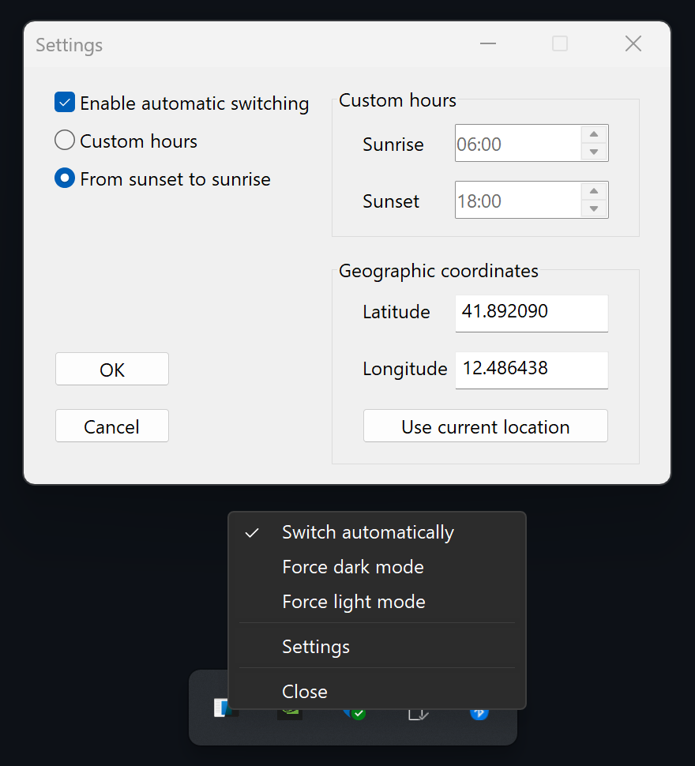

# A simple Windows dark/light mode switcher

This application allows you to automatically switch between light and dark mode depending on the time of day. It's lightweight and small.

## Installation

* Download it here: https://github.com/lhecker/windows-dark-mode-switcher/releases/tag/v0.1.2
* Unzip the archive
* Put `dark-mode-switcher.exe` into this directory:
  ```
  %APPDATA%\Microsoft\Windows\Start Menu\Programs\Startup
  ```
* You can delete the `dark-mode-switcher.pdb` file if you don't need it. It's meant for debugging.

## Example screenshot

<div style="max-width: 440px; margin: 0 auto">



</div>
